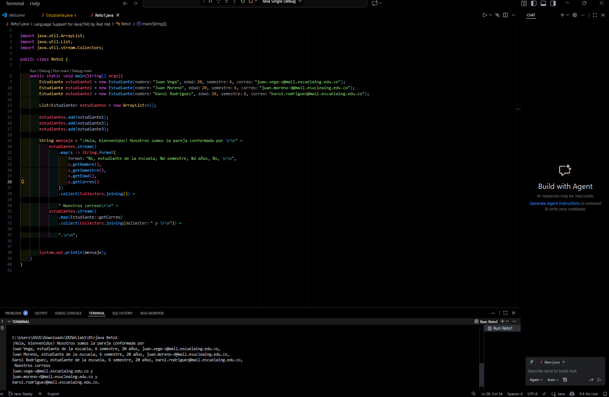
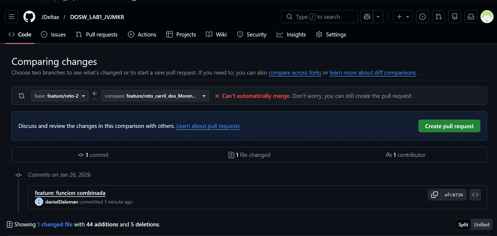
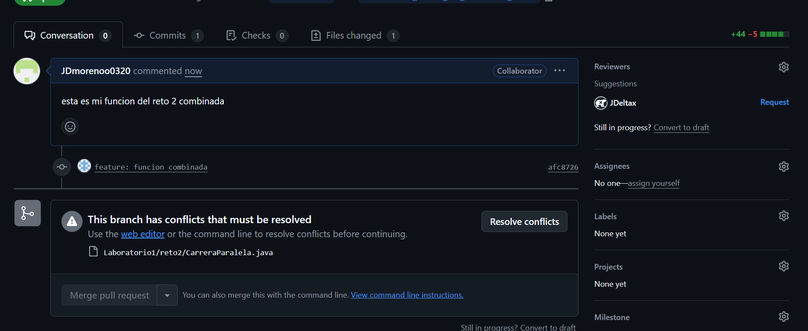
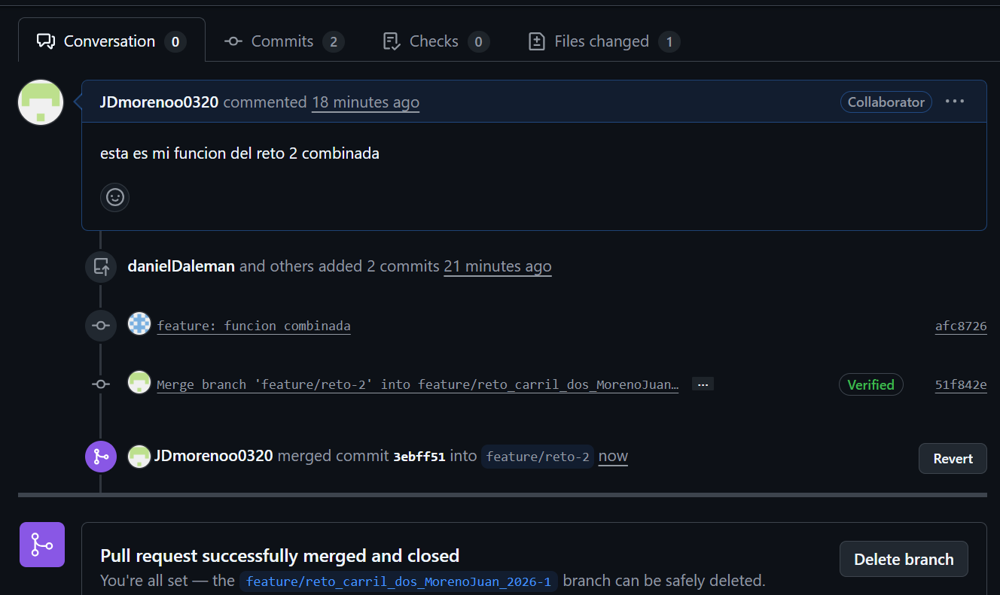
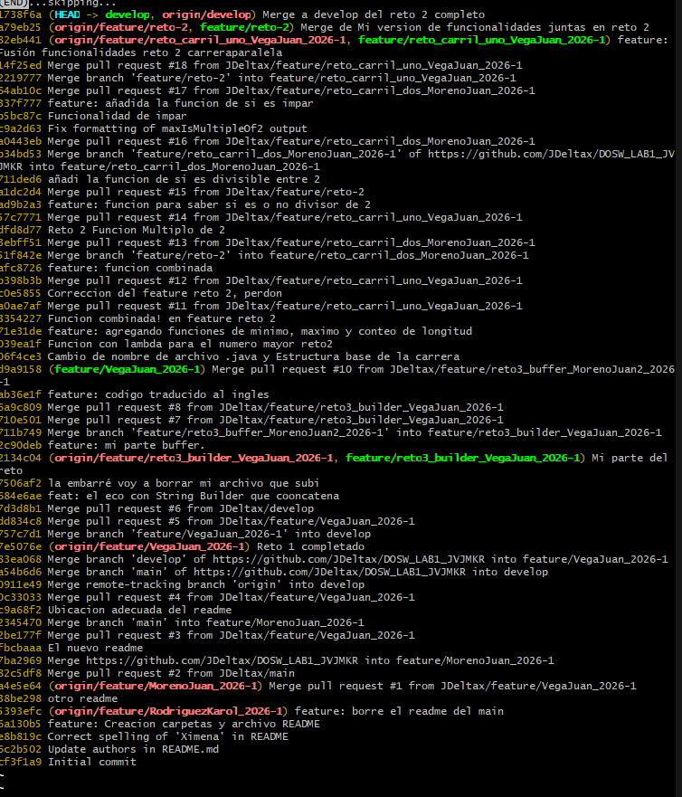
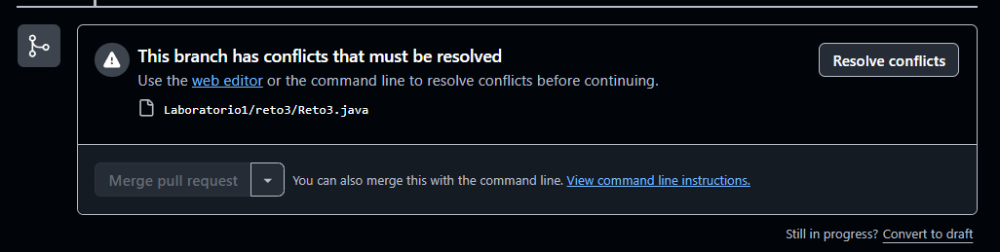
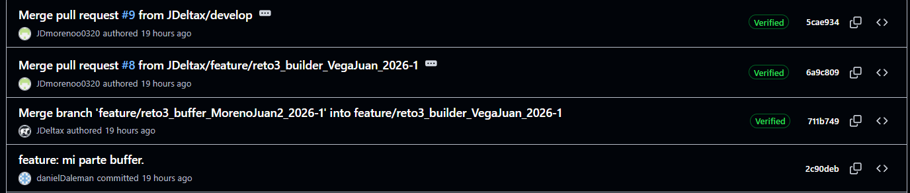

# Maratón Git 2026-1

## Integrantes
- Moreno D'Aleman Juan David
- Rodriguez Reyes Karol Ximena
- Vega Villamil Juan Pablo

---

## Retos Completados

### RETO 1
**EVIDENCIA**

Descripción:

Se creó la clase estudiante la cual almacenaría datos importantes como nombre, semestre y correo.
Luego de eso hacemos la funcionalidad en la parte main, creamos los estudiantes  y a su vez añadirlos a una lista
la cual va a pasar por el proceso del stream para obtener los datos mediante el colector.

### RETO 2

Descripción:
Se siguió el paso a paso dado por el lab donde primero es hacer los cambios y llegar a ese conflicto
(reto2-1, reto2-2) donde se procede a ajustar y corregir, decidiendo que cambios guardar o actualizar (reto2-3).
Ya para la prueba final se hacen los cambios por parte y parte, luego realizamos los commits y respectivo push, además se revisa
el log como evidencia (reto 2-4)

### RETO 3

Descripción: 
Se vuelve a la dinámica de arreglar un conflicto de commits al realizar la unión de los respectivos ejercicios, esto
al tener lineas alteradas que hizo el otro arroja el conflict al intentar hacer merge (reto3-1).
Pasamos a resolver el problema del merge decidiendo que cambios conservar (reto3-2) y finalmente se muestra la prueba de 
que hicieron las correcciones (reto3-3)

---

---

## Preguntas Teóricas

### 1. Diferencia entre git merge y git rebase

- Git merge crea un nuevo commit de fusión que une dos ramas, preservando el historial completo de ambas ramas. 
Mantiene la cronología real de los cambios y crea una estructura con múltiples padres.

- Git rebase reescribe el historial moviendo o "rebasando" los commits de una rama sobre otra. 
Toma los commits de tu rama actual y los reaplica sobre la punta de la rama objetivo, creando un historial lineal.

### 2. Conflicto al modificar la misma línea

- Cuando dos ramas modifican la misma línea de un archivo, Git no puede decidir automáticamente cuál cambio mantener. 
Esto genera un conflicto de merge que debe resolverse manualmente.
Git marca el conflicto en el archivo con marcadores especiales y de esta manera, el desarrollador debe editar el archivo, 
elegir qué cambio mantener (o combinar ambos), eliminar los marcadores y hacer commit del resultado.

### 3. Ver historial gráfico en consola

- El comando principal es:

git log --graph --oneline --all --decorate

Donde:

• --graph: muestra líneas ASCII representando las ramas
• --oneline: formato compacto de una línea por commit
• --all: incluye todas las ramas, no solo la actual
• --decorate: muestra nombres de ramas y tags

### 4. Diferencia entre commit y push

- Commit es una operación local que guarda cambios en el repositorio de la máquina (local). 
Crea un snapshot de los archivos en el área de staging y lo añade al historial local.

- Push es una operación remota que envía los commits locales al repositorio remoto.
Sincroniza el trabajo con el servidor para que otros puedan acceder a él.

### 5. Utilidad de git stash y git pop

- Git stash guarda temporalmente cambios no commiteados (modificaciones en working directory y staging area) 
en una "pila" y limpia el directorio de trabajo.
Esto es útil cuando se necesita cambiar de rama pero no se busque hacer commit de trabajo incompleto.

- Git pop (más específicamente git stash pop) recupera los cambios guardados más recientes del stash y
los aplica al directorio de trabajo actual, eliminándolos de la pila.

### 6. Diferencia entre HashMap y HashTable

**Imagen de la tabla**

### 7. Ventajas de Collectors.toMap() sobre bucle tradicional

-- Las ventajas principales son las siguientes:

*1. Código más conciso y legible: Expresión declarativa vs imperativa*
*2. Menos propenso a errores: No se necesita inicializar el mapa ni gestionar la lógica de inserción manualmente*
*3. Integración con Streams: Se combina naturalmente con operaciones de filtrado, mapeo y transformación*
*4. Manejo de colisiones: Permite especificar estrategia de merge cuando hay claves duplicadas*
*5. Inmutabilidad opcional: Puede crear mapas inmutables directamente*

###8 . Tipo de operación con stream().map()

- stream().map() realiza una operación de transformación. 
Es una operación intermedia que aplica una función a cada elemento del stream y produce un nuevo stream con los resultados transformados.

Las características son las siguientes:

- Operación intermedia: retorna un Stream, permite encadenar más operaciones
- Lazy evaluation: no se ejecuta hasta que se invoca una operación terminal
- 1 a 1: cada elemento de entrada produce exactamente un elemento de salida

### 9. Funcionamiento de stream().filter()

- stream().filter() filtra elementos según un predicado (condición booleana). Solo los elementos que cumplen la condición pasan al siguiente paso.
Como tal retorna: Un nuevo Stream conteniendo únicamente los elementos que satisfacen el predicado.

Las características son las siguientes:

- Operación intermedia (retorna Stream)
- Recibe un Predicate<T> (función que retorna boolean)
- Puede reducir el número de elementos (0 a N elementos)

### 10. Crear rama desde develop para funcionalidad nueva paso a paso:

1. Asegurarse de estar en develop actualizado:
*git checkout develop git pull origin develop*

2. Crear y cambiar a la nueva rama:
*git checkout -b feature/nombre-funcionalidad*
**(Convención: usar prefijo feature/ seguido de nombre descriptivo)**

3. Desarrollar la funcionalidad:
*• Hacer cambios en el código*
*• Hacer commits regulares: git add . y git commit -m "mensaje descriptivo"*

4. Subir la rama al remoto:
*git push -u origin feature/nombre-funcionalidad*

5. Crear Pull Request/Merge Request:
*• Desde la plataforma (GitHub/GitLab) para fusionar en develop*
*• Esperar revisión de código si aplica*

### 11. Diferencia entre git branch y git checkout -b

**git branch nombre-rama:**

- Solo crea la rama
- No cambia la posición (se conserva la posición en la rama actual)
- Se necesita *git checkout nombre-rama* después para cambiar a ella

**git checkout -b nombre-rama:**

- Crea y cambia a la nueva rama en un solo comando
- Equivalente a ejecutar git branch nombre-rama + git checkout nombre-rama
- Más conveniente y eficiente

### 12. Por qué usar ramas feature/ en lugar de trabajar en main

-Las razones fundamentales para trabajar en las ramas feature en lugar del *main* son las siguientes:

1. Protección de código estable: main/master debe contener código probado y funcional, listo para producción
2. Desarrollo paralelo: Múltiples desarrolladores pueden trabajar en diferentes features simultáneamente sin interferir
3. Revisión de código: Las feature branches facilitan code reviews mediante Pull Requests antes de integrar cambios
4. Rollback sencillo: Si una funcionalidad falla, se descarta la rama sin afectar main
5. Historial limpio: Permite organizar commits relacionados y hacer squash antes del merge
6. CI/CD: Facilita pruebas automatizadas en ramas específicas antes de afectar producción
7. Metodología Git Flow: Es práctica estándar en equipos profesionales siguiendo workflows establecidos

-Las consecuencia de trabajar directo en main pueden presentarse en formas de: 

1. Código roto en producción
2. Commits desordenados
3. Dificultad para revertir cambios
4. Imposibilidad de trabajo colaborativo efectivo
